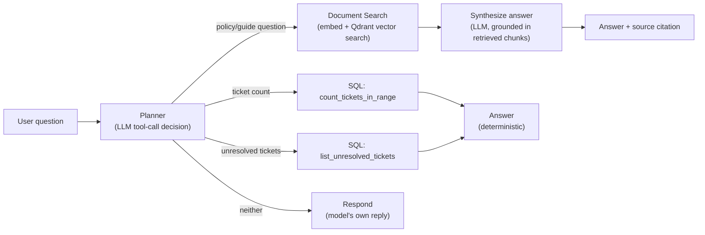

# Enterprise Healthcare Knowledge Agent

An internal AI agent for **MedFlow Health Systems** — a fictional B2B healthcare SaaS company — that lets employees ask natural-language questions and get answers grounded in real company documents and live ticket data, instead of digging through a wiki or a support dashboard.

> MedFlow Health Systems, its policies, and its support tickets are entirely fictional, created for this project. No real patient data, PHI, or company information is used anywhere.

It's a portfolio project built to demonstrate the core skills behind production AI agents: retrieval-augmented generation, SQL analytics via tool calling, LLM-driven orchestration, and the governance layer (cost tracking, prompt-injection defense) that real deployments need but demos usually skip.

## What it does

Ask it things like:

- *"What is our password policy?"* → retrieves the relevant HIPAA security policy section and synthesizes a grounded answer, cited by source document.
- *"How long does provider onboarding take?"* → same, pulled from the onboarding guide.
- *"How many tickets were opened last month?"* → runs a parameterized SQL query against the ticket database.
- *"List unresolved tickets."* → same, no parameters needed.

A single LLM call decides which of these three tools (if any) the question needs — there's no keyword matching or intent classifier, the routing itself is a real tool-calling decision made by the model.

## How it works



Every LLM call — the planner's tool-call decision and the RAG answer synthesis — goes through a single `LlmGateway` chokepoint that handles cost tracking, latency logging, and prompt-injection screening. Nothing calls the Groq client directly.

**Two prompt-injection defenses, not one.** The gateway screens both the user's question *and* any retrieved document content before it reaches the model — the second one matters because a RAG pipeline's real injection risk isn't just "a user types something malicious," it's *indirect* injection: a payload planted inside a document that later gets retrieved and fed back into the prompt as trusted context.

**Grounded, not hallucinated.** The synthesis step is explicitly instructed to answer only from the retrieved context and say so when it can't — verified in practice: asking about something the documents don't cover (e.g. PTO carryover, which the handbook never mentions) correctly returns "I don't have enough information" instead of a plausible-sounding guess. The source citation is appended in code, not left to the model to self-report, since models are unreliable narrators of their own sourcing.

## Tech stack

| Layer | Choice | Why |
|---|---|---|
| API | FastAPI | async-friendly, typed request/response models via Pydantic |
| Orchestration | LangGraph | explicit conditional routing between tools, not a black-box agent loop |
| LLM inference | Groq (`openai/gpt-oss-20b`) | fast + cheap enough to make every planner decision a real LLM call, not a keyword heuristic |
| Embeddings | sentence-transformers (`all-MiniLM-L6-v2`) | local, no API cost, no network dependency at query time |
| Vector search | Qdrant (embedded, in-memory) | a real vector database API without needing a server process or Docker |
| Relational data | SQLAlchemy + SQLite | Postgres-ready ORM layer, SQLite for local/dev simplicity |
| Validation | Pydantic v2 | every tool input/output is a typed model, not a loose dict |
| Testing | pytest | 47 tests, real fakes over mocks, live-API tests gated behind an env var |
| Tooling | uv | dependency management and running |

## Getting started

```bash
# 1. Install dependencies
uv sync

# 2. Configure secrets
cp .env.example .env
# edit .env: set GROQ_API_KEY (get one at https://console.groq.com/keys)
# and JWT_SECRET (generate with: python -c "import secrets; print(secrets.token_hex(32))")

# 3. Run the server
uv run uvicorn app.main:app --reload

# 4. Try it
curl -X POST http://127.0.0.1:8000/ask \
  -H "Content-Type: application/json" \
  -d '{"question": "What are the password requirements?"}'
```

Or open `http://127.0.0.1:8000/docs` for an interactive Swagger UI.

## Running tests

```bash
uv run pytest
```

Tests that require a real Groq API call are marked and automatically skipped if `GROQ_API_KEY` isn't set in `.env` — everything else runs against fakes/in-memory fixtures, no network access needed.

## Project structure

```
app/
  api/       # FastAPI routes
  core/      # settings/config
  database/  # SQLAlchemy session setup
  graph/     # LangGraph orchestration (the planner + routing logic)
  models/    # SQLAlchemy models (Ticket, LlmUsage)
  services/  # LlmGateway, DocumentIndex, prompt-injection screening
  tools/     # DocumentSearchTool, SQL tools - the things the planner can call
documents/   # the markdown corpus DocumentSearchTool indexes
tests/
```

## What's deliberately not here yet

This was built incrementally, one justified component at a time, rather than scaffolded upfront — so a few things real production systems would need are intentionally still open:

- **Authentication.** The `/ask` endpoint is unauthenticated. Real deployment would need JWT auth scoped to the internal employee roles this is designed for.
- **Human-in-the-loop approval.** Everything built so far is read-only (Q&A, analytics). A natural next step is a mutating action (e.g. escalating or updating a ticket) that the agent proposes but a human must approve before it executes — LangGraph supports this pattern directly.
- **CI.** Tests exist and run in seconds locally; they aren't yet wired into GitHub Actions.
- **Containerization.** No Dockerfile yet - `uv sync` + `uv run` is the whole local setup story for now.
